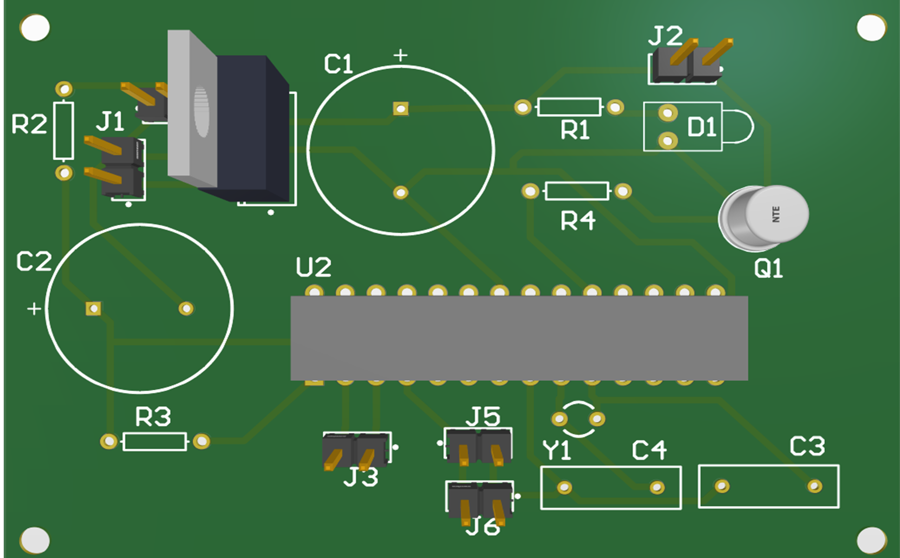
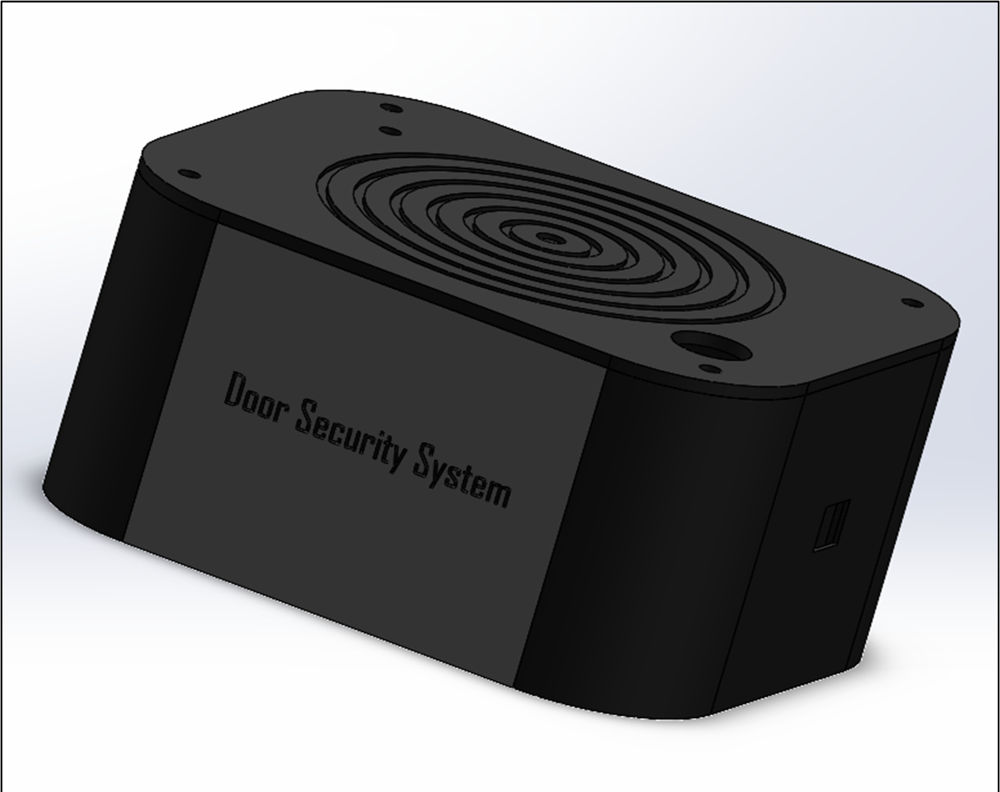
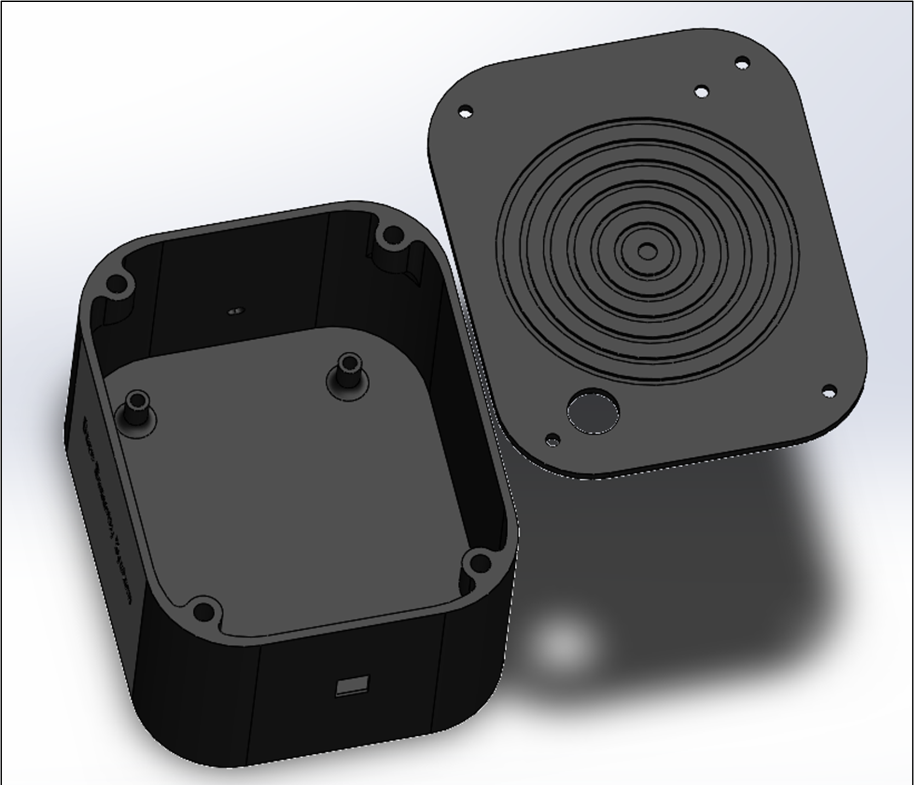

# Door_security_system

This repository contains the project details for Door security system designed as part of the Semester 4 EN2160 Electronic Design Realization module. This Home Security Alert System utilizes ATmega328p and a Reed switch to detect unauthorized entry. When triggered, it activates a loud buzzer and sends SMS alerts via the GSM module. Protect your home and loved ones effortlessly with real-time notifications for ultimate peace of mind.

## Product Introduction
This door security system serves as a robust deterrent against unauthorized entry. Whenever an intruder attempts to access the house without permission, the system will immediately activate a loud buzzer while also promptly sending a direct message to the homeowner. Rest assured that this intelligent solution will protect your home by alerting you in real-time when any unauthorized access is detected.

## Target Customers 
  1. Homeowners: Individuals or families who want to enhance the security of their homes and ensure the safety of their property and loved ones.
  2. Small Business Owners: Small businesses and shops that require a cost-effective yet reliable security solution to protect their premises during non-business hours.
  3. Renters: Tenants who want to add an extra layer of security to their rental properties without making permanent installations.
  4. Elderly or Vulnerable Individuals: Seniors or people with specific vulnerabilities who seek a simple and effective way to bolster the security of their living spaces.
  5. Vacation Homeowners: Owners of vacation homes or secondary residences who want to keep their properties secure while they are away for extended periods.
  6. Airbnb Hosts: Hosts who wish to provide a secure environment for their guests and ensure only authorized individuals access their properties.
  7. Small Offices: Businesses with small office spaces that require a basic yet efficient security system to protect sensitive information and assets.
  8. Pet Owners: Individuals who want to keep their pets safe from potential intruders and ensure their wellbeing while they are not at home.
  9. Security-conscious Individuals: People who prioritize security and want to have peace of mind knowing they will be alerted if someone attempts unauthorized entry.
  10. Tech Enthusiasts: Customers interested in smart home technologies and automation, looking to integrate a smart security system into their living spaces.
      
## Additional features 
  1. Buzzer – Assists in notifying the owner whenever there is an unauthorized entry. 
  2. Reed Switch – It is used to identify instances of unauthorized entry.
  3. Key Switch – The Reed switch serves as the means to control the product's activation and deactivation. When the owner attempts to enter the house, they can use the Key switch to turn off the product.

## User interface 
The door security system was meticulously engineered with a strong focus on user-friendliness, making it accessible and manageable for individuals of all skill levels. Its intuitive design ensures that even ordinary users can effortlessly operate and navigate the system without any complexity. Furthermore, the enclosure's design was crafted with compatibility in mind, seamlessly fitting into various environments and architectural styles. By optimizing the space requirements, the system blends seamlessly with the surrounding decor, making it unobtrusive yet highly effective. This thoughtful approach to both user interface and physical design results in a seamless integration that enhances the overall user experience, offering reliable security without compromising on convenience.

Key Switch: - The key switch, conveniently located on the front side of the security system, puts the user in full control. Its secure design ensures that only authorized individuals with the suitable key can access and manage the system, providing an added layer of protection. This user-friendly approach makes it effortless for ordinary users to handle and operate the security system confidently, without the need for complex procedures. With the key switch at their fingertips, users can easily arm or disarm the system, ensuring a seamless and hassle-free experience for enhanced security and peace of mind.

DC power jack: - The system is powered by a DC 12V power adapter, and for convenient connectivity, a DC female jack is situated on the side of the product. This design allows users to effortlessly plug in the DC adapter, ensuring a reliable power source and a smooth setup process for seamless operation.

Reed Switch: - The Reed switch serves as the means to detect unauthorized entry. It consists of two parts: a magnet and a reed switch. When these components separate, the system activates the buzzer and sends a message alert. To allow for flexible placement, the Reed switch is connected to a long wire extending from the enclosure, enabling users to install it anywhere as needed.

## Implemented sketch and schematic

  

## PCB Design

  

  

## Solid works Design

  

  

